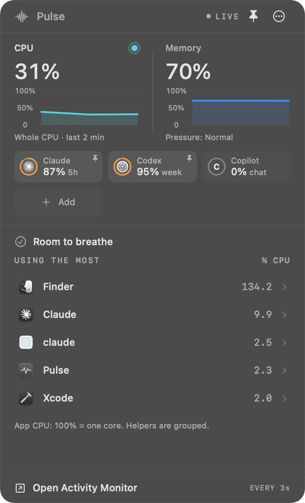
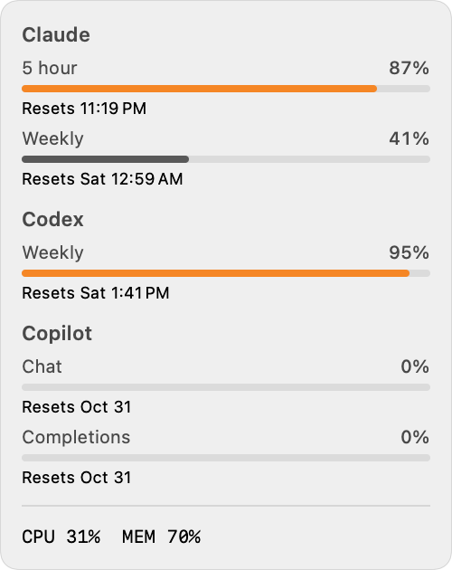

# Pulse

A small, native macOS menu bar app that shows what your Mac and your AI tools are using: CPU, memory, and how much of your Claude, Codex, Copilot, Gemini or API allowance is left.

It's lightweight (about 1% of one CPU core while closed), has no dependencies or account, and keeps everything on your Mac.

<p>
  
  
</p>

## Requirements

- Apple Silicon Mac, macOS 14 or later
- Apple's Command Line Tools (the installer offers to install them)

## Install

In Terminal:

```sh
git clone https://github.com/123-Cheese-Online-LLC/pulse && cd pulse && ./scripts/install.sh
```

The installer:

1. Checks your Mac and builds Pulse on it. A Mac-built app isn't blocked by Gatekeeper the way a downloaded one is.
2. Installs Pulse to `~/Applications` and opens it.
3. Asks whether to connect Claude for exact limits. This runs Claude Code's own sign-in; skip it and Pulse shows tokens used instead.
4. Asks whether to add Pulse to Claude Code's status line. Default no; it edits your Claude settings, with a backup.

To update later, run the same installer again from the `pulse` folder after `git pull`.

## Use

- **Menu bar:** up to three AI usage dials, then a CPU graph and percentage (choose CPU, Memory, or both in **•••**). If macOS runs out of menu bar room (a busy app, a screen-share indicator) and hides Pulse, it shrinks to the dials and CPU % so it stays visible, and tries full size again when you switch apps.
- **Hover the menu bar** for every AI tool's limits and when they reset.
- **Click** to open the panel:
  - CPU and memory over the last 2 minutes. Click a chart to rank apps by that metric.
  - AI tiles, one per connected tool. A tile shows the limit closest to running out, e.g. `84% 5h`. **Click a tile to pin it** to the menu bar (max three).
  - **+ Add** to track OpenAI or Anthropic API spend with an admin key.
  - Apps using the most, with **Show app**, **Quit** and **Force Quit**. Finder offers **Relaunch Finder**. Background processes can be stopped when they run under your account; system processes and ones your login session depends on stay protected.
- **•••** menu: menu bar readout, Launch at login, Quit Pulse.

## AI tools

Tools appear on their own once they're set up on the Mac. Nothing extra is downloaded or installed.

| Tool | Shows | How Pulse reads it |
|---|---|---|
| Claude Code | 5-hour and weekly % (or tokens used) | Claude Code's login, read-only. Without a login: token counts from its local session logs |
| Codex | 5-hour and weekly % | The Codex CLI's read-only rate-limit call |
| GitHub Copilot | Chat, completions, premium % (once you've used it) | `gh api /copilot_internal/user` with your GitHub CLI login (unofficial endpoint) |
| Gemini CLI | Tokens, last 5 hours and 7 days | Local session files in `~/.gemini/tmp` |
| OpenAI API | $ this month | Costs API, admin key added in Pulse |
| Anthropic API | $ this month | Cost API, admin key added in Pulse |

Check what Pulse can read on your Mac (prints no keys or tokens). Add `-a` to also list tools that aren't set up:

```sh
/usr/bin/python3 ~/Applications/Pulse.app/Contents/Resources/usage_bridge.py status
```

## Privacy

- Readings stay on your Mac in `~/Library/Application Support/Pulse`.
- Pulse never reads conversation text, only usage numbers.
- Logins are only sent to the service they belong to. Pulse never refreshes or edits another app's login.
- Admin keys are stored in your macOS Keychain.

## Uninstall

```sh
osascript -e 'tell application id "local.koz46.pulse" to quit'
rm -rf ~/Applications/Pulse.app ~/Library/Application\ Support/Pulse
defaults delete local.koz46.pulse
security delete-generic-password -s "Pulse: openai-admin-key"; security delete-generic-password -s "Pulse: anthropic-admin-key"
```

If you added the Claude Code status line, remove the Pulse `statusLine` entry from `~/.claude/settings.json` (a backup is at `settings.json.pulse-backup`) and the `PULSE USAGE ADVISORY` blocks from `~/.claude/CLAUDE.md` and `~/.codex/AGENTS.md`.

## Development

```sh
./scripts/build.sh      # builds build.noindex/Pulse.app
./scripts/test.sh       # unit and native checks
open build.noindex/Pulse.app --args --capture /tmp/pulse.png   # renders the panel, menu bar and hover card to PNGs
```

Add `--detail` to capture the busiest app's detail view. To add an AI tool, write one reader function in `Integrations/usage_bridge.py` that saves a usage record, and register it in `PROVIDERS`.

Version notes are in [docs/CHANGELOG.md](docs/CHANGELOG.md).
